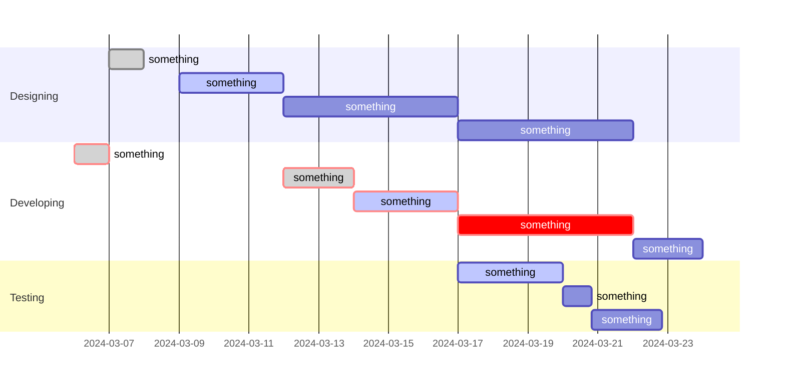

## Contribution
`Eden`
* Image export
* Colour Channel Cycling
* Error Handling
* 

`Kevin`
* Multilingual support
* Image flip
* Median filter

`Yuxing`
* Image resise
* Image invert

`Emma`
* Sharpen filter
* Soft blur filter
* Black image border issue fix

`Angus`
* Guassian blur filter
* Image rotation

## Testing

## Known Issues
- When user is prompted to enter a value for an action, if they exit out of the pop-up, the action will still be performed with the defult value.
- When an image is rotated repeatedly it migrates to the right each time the action is performed.
- When the median filter is applied, the outer ring of pixels is effected adversly. As it does not use a convolution, the same method we applied to the other filters to fix this doesnt work.
- For the reamining filters, when applied, the image will lose its outer ring of pixels each time they are applied.
## User Guide

## Significant Refactoring

## Gantt Diagram for Our Project

