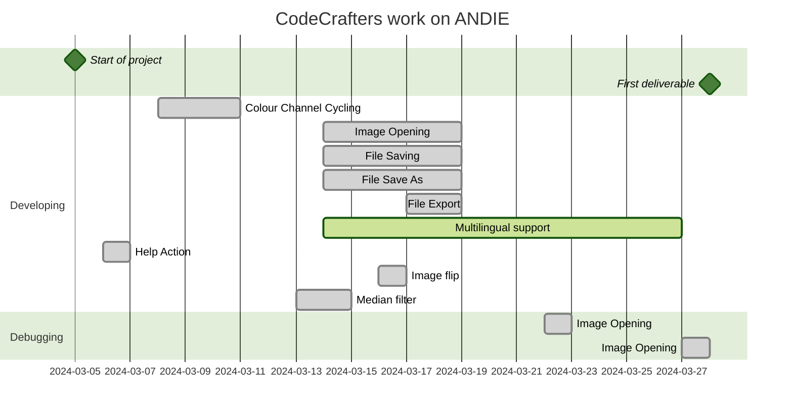

## Contribution
`Eden`
* Image export
* Save - adding logical conditions
* Save as - adding logical conditions
* Opening a file - adding logical conditions
* Exit - adding logical conditions
* Colour Channel Cycling
* Error Handling (yes with funny messages)
* Adding Traditional Chinese (Taiwan) language support
* Creating the Gantt Diagram in Readme.md
* Created the icon

`Kevin`
* Enabled Multilingual support 
* Image flip (Horizontal and Vertical)
* Median filter
* Image rotation - polishing
* Image invert (Worked with Yuxing)
* Added Bahasa Indonesia as language option
* Added a Help option and an About Us.
* Testing and debugging
  

`Yuxing`
* Image resize
* Image invert
* Image scaling

`Emma`
* Sharpen filter
* Soft blur filter
* Black image border issue fix
* Creating Readme.md
* Testing whole project during runtime for bugs
* Created Issues.txt

`Angus`
* Guassian blur filter
* Image rotation
* Testing
* User instuctions read me

## Testing
We tested our code mainly via brute force. We went through and thought of all the senarios that could occur when a user would use the program and serched for errors. We also checked for silent errors by using try catch loops and having the program print out a message to the terminal anytime an error was caught.

## Known Issues
- When user is prompted to enter a value for an action, if they exit out of the pop-up, the action will still be performed with the default value.
- When the median filter is applied, the outer ring of pixels is effected adversely. As it does not use a convolution, the same method we applied to the other filters to fix this doesn't work.
- For the remaining filters, when applied, the image will lose its outer ring of pixels each time they are applied
- If an image's ops file is deleted after actions are performed, when the user exits they will not be prompted to save
- Rotating images by arbitrary angles is an experimental feature and is needing refinement
- UI is not as harmonious as we would like it to be

## User Guide

Prerequisites
- Java Development Kit (JDK): You'll need a recent version of the JDK installed on your system. Download and install it from the official Oracle website: https://www.oracle.com/nz/java/technologies/downloads/. Verify the installation by opening a terminal and running java -version.

- Gradle: Version 8.6

Installation
- Clone or Download the Project: Obtain the project files using your preferred method (Git clone or direct download).

Running the program
- Open Terminal and navigate to project directory
- Run
`gradle build` 
- Run `gradle run`
- to open files go to file > open

## Significant Refactoring

None done yet. 

## Gantt Diagram for Our Project (still under construction)

