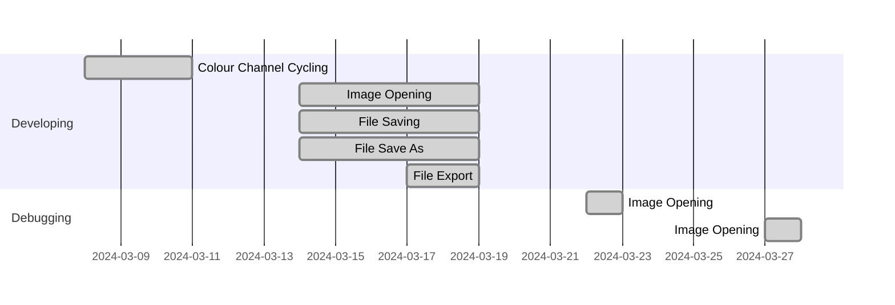

## Contribution
`Eden`
* Image export
* Save - adding logical conditions
* Save as - adding logical conditions
* Opening a file - adding logical conditions
* Exit - adding logical conditions
* Colour Channel Cycling
* Error Handling (yes with funny messages)
* Adding Traditional Chinese (Taiwan) language support
* Creating the Gantt Diagram in Readme.md

`Kevin`
* Multilingual support
* Image flip
* Median filter
* Image rotation - polishing
* Image invert (Worked with Yuxing)

`Yuxing`
* Image resize
* Image invert
* Image scaling

`Emma`
* Sharpen filter
* Soft blur filter
* Black image border issue fix
* Creating Readme.md
* Testing whole project during runtime for bugs
* Created Issues.txt

`Angus`
* Guassian blur filter
* Image rotation
* Testing

## Testing

## Known Issues
- When user is prompted to enter a value for an action, if they exit out of the pop-up, the action will still be performed with the default value.
- When the median filter is applied, the outer ring of pixels is effected adversely. As it does not use a convolution, the same method we applied to the other filters to fix this doesn't work.
- For the remaining filters, when applied, the image will lose its outer ring of pixels each time they are applied
- If an image's ops file is deleted after actions are performed, when the user exits they will not be prompted to save
- Rotating images by arbitrary angles is an experimental feature and is needing refinement
- UI is not as harmonious as we would like it to be
## User Guide

## Significant Refactoring

## Gantt Diagram for Our Project

