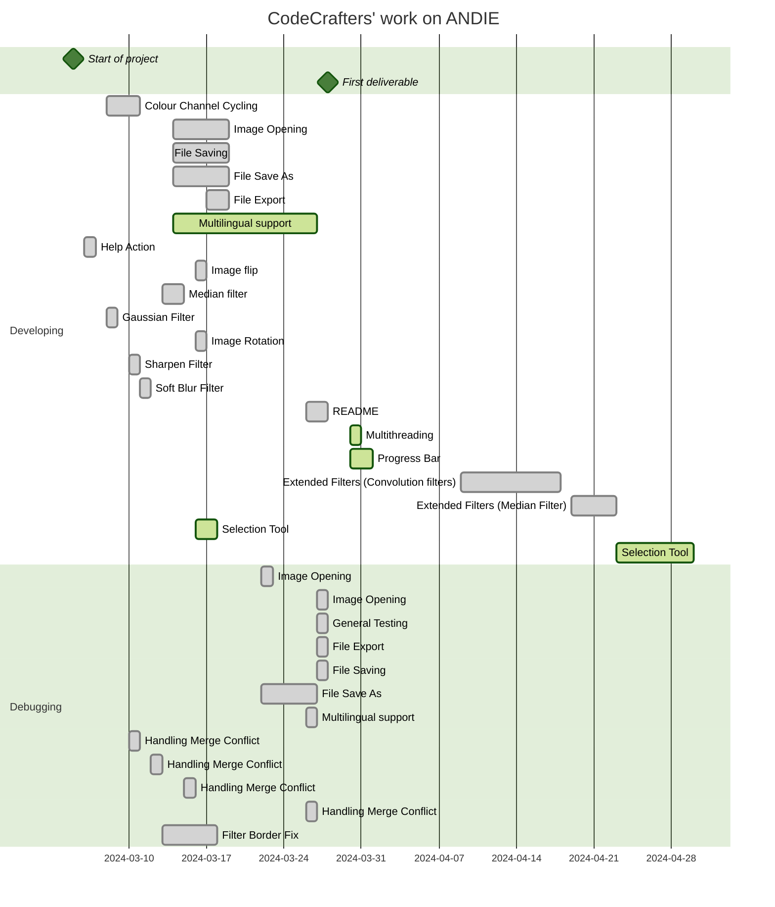

<h2>
 ANDIE - A Non-Destructive Image Editor

Made by the CodeCrafters Team
</h2>

## Contribution
`Eden`
* Image export
* Improved Save function
* Improved Save as function
* Improved File Opening function
* Improved File Exit function
* Colour Channel Cycling
* Error Handling (yes with funny messages)
* Adding Traditional Chinese (Taiwan) language support
* Created the icon
* Implemented multithreading for median filter
* Added two types of keyboard hotkeys and their instructions

`Kevin`
* Enabled Multilingual support 
* Image flip (Horizontal and Vertical)
* Median filter
* Image rotation - polishing
* Image invert (Worked with Yuxing)
* Added Bahasa Indonesia as language option
* Added a Help option and an About Us.
* Testing and debugging
* Added progress bar to median filter
* Random Scattering

`Yuxing`
* Image resize
* Image invert
* Image scaling

`Emma`
* Sharpen filter
* Soft blur filter
* Black image border issue fix
* Creating Readme.md
* Testing whole project during runtime for bugs
* Created Issues.txt
* Encapsulation of code to pad border of images - FilterBorder.java
* Extended filters

`Angus`
* Guassian blur filter
* Image rotation
* Testing
* User instuctions read me

## Testing
We tested our code mainly via brute force. We went through and thought of all the senarios that could occur when a user would use the program and serched for errors. We also checked for silent errors by using try catch loops and having the program print out a message to the terminal anytime an error was caught.

## Known Issues
- When user is prompted to enter a value for an action, if they exit out of the pop-up, the action will still be performed with the default value.
- When the median filter is applied, the outer ring of pixels is effected adversely. As it does not use a convolution, the same method we applied to the other filters to fix this doesn't work.
- For the remaining filters, when applied, the image will lose its outer ring of pixels each time they are applied
- If an image's ops file is deleted after actions are performed, when the user exits they will not be prompted to save
- Rotating images by arbitrary angles is an experimental feature and is needing refinement
- UI is not as harmonious as we would like it to be

## User Guide

⚠️Prerequisites⚠️
- Java Development Kit (JDK): You'll need a recent version of the JDK installed on your system. Download and install it from the official Oracle website: https://www.oracle.com/nz/java/technologies/downloads/. Verify the installation by opening a terminal and running java -version.

- Gradle: Version 8.6

🔧Installation🔧
- Clone or Download the Project: Obtain the project files using your preferred method (Git clone or direct download).

🏃Running the program🏃
- Open Terminal and navigate to project directory
- Run `gradle build` 
- Run `gradle run`
- To open files, go to file > open

   🔥Hot
keys🔥

<!--https://helpx.adobe.com/tw/photoshop/using/default-keyboard-shortcuts.html-->

| Menus  | Actions                | Windows                | macOS   | Windows & macOS   | Alternative                    |
|--------|------------------------|------------------------|---------|-------------------|--------------------------------|
| **F**ile   | **O**pen File              | Ctrl + O               | ⌘ O     | F - O             |                                |
|        | **S**ave File              | Ctrl + S               | ⌘ S     | F - S             |                                |
|        | Save **A**s                | Ctrl + Shift + S       | ⇧⌘ S    | F - A             |                                |
|        | **E**xport                 | Ctrl + E               | ⌘ E     | F - E             |                                |
|        | Exit (**Q**)                   | Ctrl + Q               | ⌘ Q     | F - Q             | Alt + F4 (Windows)             |
|        | **S**et Language               |                        |         | F - L             |                                |
| **E**dit   | **U**ndo                   | Ctrl + Z               | ⌘ Z     | E - U             |                                |
|        | **R**edo                   | Ctrl + Y               | ⌘ Y     | E - R             | Ctrl/Cmd + Shift + Y (Win/Mac) |
| **V**iew   | Zoom **i**n                | Ctrl + "+"             | ⌘ +     | V - I             |                                |
|        | Zoom **o**ut               | Ctrl + "-"             | ⌘ -     | V - O             |                                |
|        | Zoom **f**ull              | Ctrl + 0               | ⌘ 0     | V - F             | Ctrl/Cmd + 1 (Win/Mac)         |
| Fi**l**ter | **M**ean Filter            |                        |         | L - M             |                                |
|        | **S**oft Blur              |                        |         | L - S             |                                |
|        | S**h**arpen Filter         |                        |         | L - H             |                                |
|        | **G**aussian Filter        |                        |         | L - G             |                                |
|        | Me**d**ian Filter          |                        |         | L - D             |                                |
|        | **E**mboss Filter          |                        |         | L - E             |                                |
| **C**olour | **G**reyscale              |                        |         | C - G             |                                |
|        | **I**nvert Colour          | Ctrl + I               | ⌘ I     | C - I             |                                |
|        | **C**olour Channel Cycling |                        |         | C - C             |                                |
| **I**mage  | Flip **H**orizontal        |                        |         | I - H             |                                |
|        | Flip **V**ertical          |                        |         | I - V             |                                |
|        | **R**otate Image           |                        |         | I - R             |                                |
|        | Image R**e**size           | Ctrl + Alt + I         | ⌥ ⇧ ⌘ I | I - E             |                                |
|        | R**a**ndom Scattering      |                        |         | I - A             |                                |
|        | Image **S**caling          |                        |         | I - S - 1/2/3/4/5 |                                |
|        | R**o**tate By              |                        |         | I - O - 1/2/3     |                                |
| **H**elp   | **A**bout us               |                        |         | H - A             |                                |
|        | **H**otkey Instructions    | Alt + Shift + Ctrl + K | ⌥ ⇧ ⌘ K | H - H             | F1                             |
## Significant Refactoring

None done yet. 

## Gantt Diagram for Our Project

